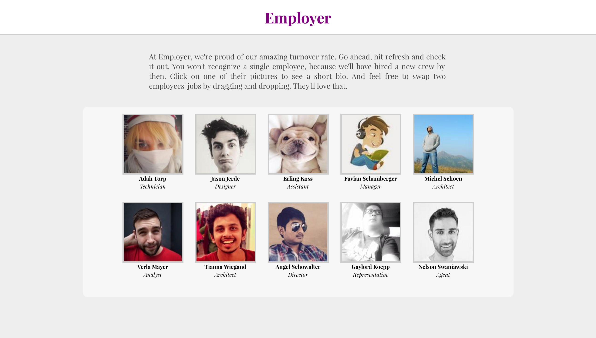

# Employer

## Summary

Employer is a made-up employees page for a made-up company called Employer.

## Setup
* Make sure to run `npm install` and `webpack --watch` to get Node packages installed and bundle the .js files
* Serve the files locally or load index.html into your browser of choice

## Usage
* When the page loads, it fires off fetch requests to the [uifaces.com][uif-link] API to generate random employee images.
* The `faker` package is used for generating random names and job titles for employees.
* Hovering over an employee's image will animate the image.
* Clicking on an employee's image will open up a modal with a short, cut-and-paste bio about that employee.
* Dragging one employee's job and dropping it on another's will swap the two jobs with help from the `react-dnd` package.

## Main Tools
* React
* Redux
* ES6
* HTML5/CSS3

## Assorted NPM Packages

* `react-redux`
* `react-dnd` for drag and drop
* `redux-thunk` to allow Redux actions to use async functions
* `babel` for transpiling ES6 and JSX
* `faker` for generating fake names and job titles
* `webpack` for bundling .js files
* `isomorphic-fetch` for a fetch polyfill
* `eslint` for linting ES6

## Other
* [uifaces.com][uif-link]'s API
* [Font Awesome][fa-link]
* [Google Fonts][gf-link]
[fa-link]: https://fortawesome.github.io/Font-Awesome/
[gf-link]: https://google.com/fonts
[uif-link]: http://uifaces.com
